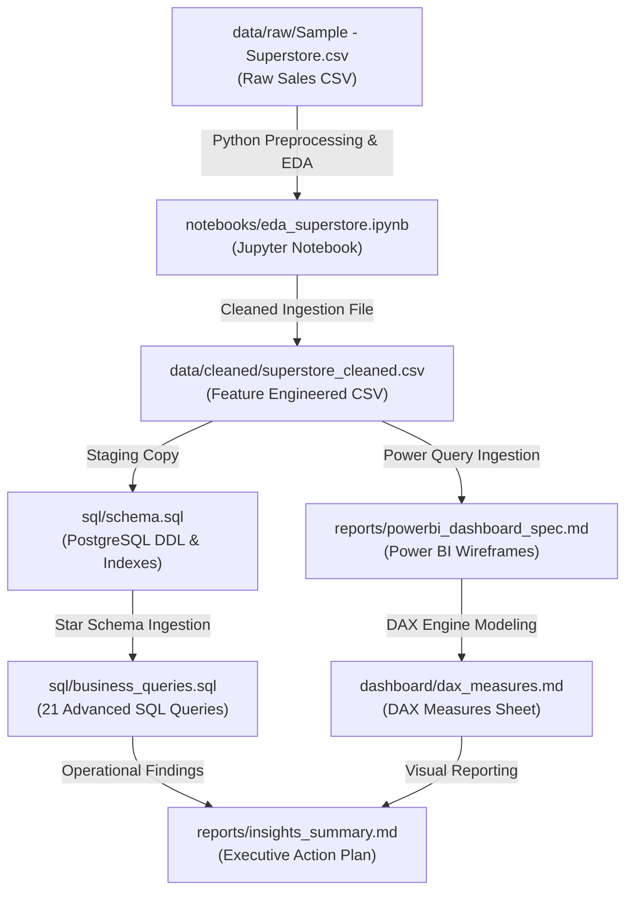

# Sales & Revenue Analytics Dashboard

[](https://www.python.org/)
[](https://www.postgresql.org/)
[](https://powerbi.microsoft.com/)

---

## 🛠️ Tech Stack & Skills
*   **Data Preprocessing & EDA**: Python (`Pandas`, `NumPy`, `Matplotlib`, `Seaborn`, `Plotly`, `Jupyter`)
*   **Database & Data Warehousing**: SQL (PostgreSQL dialect, DDL, Star Schema, Indexes)
*   **Advanced SQL Inquiries**: CTEs, Window Functions (Ranking, Running Totals, Moving Averages), Cohorts, Pareto (80/20) Analysis
*   **Business Intelligence & Dashboards**: Power BI, DAX (Time Intelligence, Customer Loyalty, SLA Compliance)
*   **Business Communication**: Technical documentation, executive summaries, data storytelling

---

## 📐 Data Pipeline Architecture



---

## 📁 Repository Structure

```text
sales-revenue-analytics/
├── data/                               # Project Datasets
│   ├── raw/
│   │   └── Sample - Superstore.csv      # Tableau raw retail transactions
│   └── cleaned/
│       └── superstore_cleaned.csv      # Preprocessed & engineered dataset
├── notebooks/
│   └── eda_superstore.ipynb            # Jupyter notebook detailing EDA & charts
├── sql/
│   ├── schema.sql                      # PostgreSQL star-schema structures & ETL
│   └── business_queries.sql            # 21 production-grade SQL queries
├── dashboard/
│   └── dax_measures.md                 # Power BI DAX formulas sheets
├── reports/
│   ├── powerbi_dashboard_spec.md       # 4-page Power BI dashboard design wireframes
│   └── insights_summary.md             # Business insights & executive summary
├── requirements.txt                    # Python requirements checklist
├── .gitignore                          # Git exclusions file
├── LICENSE                             # MIT License
└── README.md                           # Portfolio landing page (This file)
```

---

## How to Run the Project

### Phase 1: Python EDA and Preprocessing
1.  **Clone the Repository**:
    ```bash
    git clone https://github.com/yourusername/sales-revenue-analytics.git
    cd sales-revenue-analytics
    ```
2.  **Install Dependencies**:
    ```bash
    pip install -r requirements.txt
    ```
3.  **Explore & Clean Data**:
    *   Open and run the Jupyter notebook (`notebooks/eda_superstore.ipynb`) cell-by-cell in your favorite environment (Jupyter Lab, VS Code, etc.).
    *   *Note: Running the cells in this notebook performs data validation, feature engineering, visualization, and saves the cleaned output CSV to `data/cleaned/superstore_cleaned.csv`.*

### Phase 2: SQL Database Setup (PostgreSQL)
1.  **Database DDL Execution**:  
    Open your PostgreSQL client (pgAdmin, DBeaver, or psql) and run [sql/schema.sql](file:///c:/Users/ARIKUMA/.gemini/antigravity/scratch/sales-revenue-analytics/sql/schema.sql) to create the tables (`staging_superstore`, `dim_customers`, `dim_products`, `dim_geography`, `fact_sales`) and database indexes.
2.  **Injest Data**:  
    Load the cleaned data `data/cleaned/superstore_cleaned.csv` into the `staging_superstore` table.
3.  **Run ETL Queries**:  
    Execute the `INSERT INTO` queries located at the bottom of the schema script to populate your dimensional star schema.
4.  **Execute BI Inquiries**:  
    Run [sql/business_queries.sql](file:///c:/Users/ARIKUMA/.gemini/antigravity/scratch/sales-revenue-analytics/sql/business_queries.sql) to run the 21 business queries.

### Phase 3: Power BI Dashboard Modeling
1.  **Import Clean Data**: Open Power BI Desktop, choose **Get Data > Text/CSV**, and select `data/cleaned/superstore_cleaned.csv`.
2.  **Apply Layout**: Follow the detailed wireframes and navigation instructions in the [powerbi_dashboard_spec.md](file:///c:/Users/ARIKUMA/.gemini/antigravity/scratch/sales-revenue-analytics/reports/powerbi_dashboard_spec.md) document to design the four pages:
    - *Page 1: Executive Overview*
    - *Page 2: Regional Performance*
    - *Page 3: Product Analytics*
    - *Page 4: Customer Insights*
3.  **Implement DAX Measures**: Copy and paste the DAX formulas defined in [dax_measures.md](file:///c:/Users/ARIKUMA/.gemini/antigravity/scratch/sales-revenue-analytics/dashboard/dax_measures.md) to build KPI cards and time-intelligence tables.

---

## 💡 Top Strategic Business Insights

> [!WARNING]
> **High Discount Rate Margin Damage**  
> Direct analysis shows that while discounts over 50% successfully increase order volume, they generate an average net profit margin of **-119.20%**. This is causing major revenue leakage, particularly in Furniture (Tables/Bookcases). Eliminating discounts above 20% on these categories is estimated to recover **up to $19,000 annually** ($76,500 over the 4-year period).

*   **Technology Dominance**: The Technology category generates the highest operating profit margin (**17.40%**), driven by Copiers and Phones, while Furniture operates on extremely thin margins (**2.49%**) and suffers from high shipping and discount overhead.
*   **Geographic Variations**: West and East regions are the most profitable (**14.94%** and **13.48%** margins), whereas Central and South regions show margin dilution (**7.92%** and **11.93%**) due to aggressive pricing discounting and higher long-haul freight costs.
*   **Supply Chain Bottlenecks**: During the peak Q4 holiday shopping period (December), Standard Class shipping delays spike to **33.17%**, indicating carrier capacity bottlenecks.

*Read the full business report in [reports/insights_summary.md](file:///c:/Users/ARIKUMA/.gemini/antigravity/scratch/sales-revenue-analytics/reports/insights_summary.md).*

---

## 📄 License
This repository is licensed under the MIT License. See [LICENSE](LICENSE) for details.
